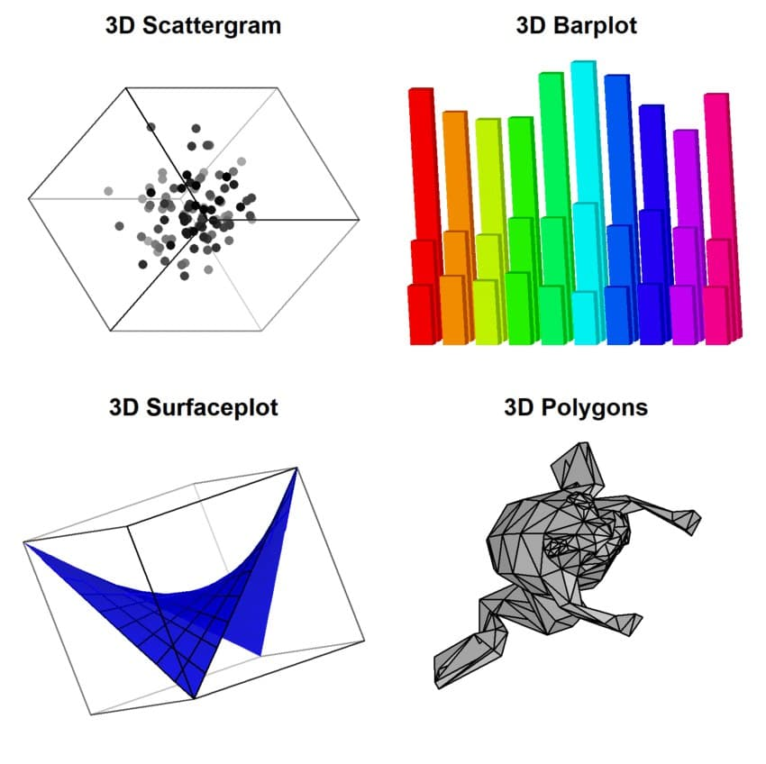

# threeD
The threeD package provides basic functions for parsing, plotting and manipulating 3D-Objects. It was written to extend R's default packages without introducing dependencies on other 

You may install the package using the following commands in R:

```
install.packages("devtools");
devtools::install_github("AndreasFischer1985/threeD", ref="main");
```


